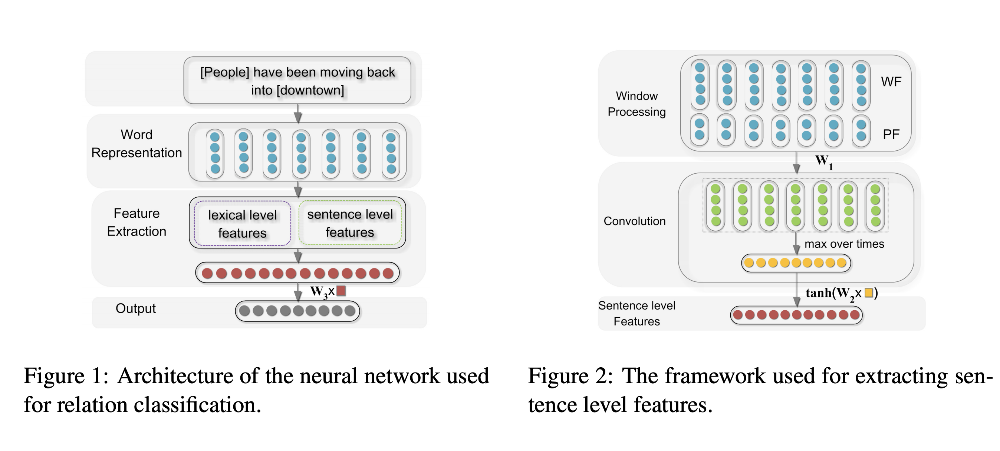

# Models

In this part, we are going to implement all kinds of different models in Relation extractions. All models are subclass constructed from BasicModel Which contains `load(self, path)` & `save(self, name=None)` method.

**Note : We save our model into ../checkpoints content with .pth format as default.**

## PCNN Model

We implement PCNN model which is a basic model first proposed in <u>Zeng 2014 "Relation Classification via Convolutional Deep Neural Network"</u>. As a Relation Extraction Method for supervised NRE model.

The Model is further illustrated below:

We extracted 2 differents aspects of the sequences. *Lexical_feature* & *Sentence_feature*: 

*Lexical_feature* contains : both entities and theirs contents(left & right nearest word) . Using 6 words embedding as the Lexical_feature.

*Sentence_feature construction:* We first use the pretrain word2vec to initialize the word embedding layers & given each word in the sequence 2 position embedding according to its relative position to entity-one & entity-two.

Now we are going to take an example to show how model does it work.

Eg :		 \<e1\>people\<\e1\> have been moving back into \<e2\>downtown<\e2>

Pos:       	     	 0					1 	   2		  3		 4		5					6 

tokens 		 	329                 23    423 	3130     21     13                  7421     

pos-to-e1		   0					1		2			3		4		5					6

Pos-to-e2		  -6					-5	  -4 		 -3 	  -2   	 -1				   0

For this example,  we use  \<PAD\>, \<people>, \<have>, \<into>,\<downtown>,\<PAD>'s word embedding as lexical feature. (left , entity, right word for each entities) 

Still we used the tokens sequence & pos-to-e1 & pos-to-e2 to construct word_emb, pos1_emb, pos2_emb with different embedding matrix. And concatenate them as the input to conv layer.

So now, we get sequence embedding which shape = torch.Size(batch_size, max_len, word_emd_dim + 2 *pos_emb_dim).

To utilize the Conv2d layers, we first unsqueeze it into (batch_size, 1, max_len, word_emd_dim + 2 *pos_emb_dim). And then conduct Conv2d(input_dim=1, output_dim=opt.filters_num, kernel_size=(3, word_emd_dim + 2 *pos_emb_dim), padding=(1, 0)). 

And finally use max_pool1d over length dim to make our model insensitive with sequence length.

Finally concatenate the lexical & sentence feature push them into a linear layer with softmax activation.